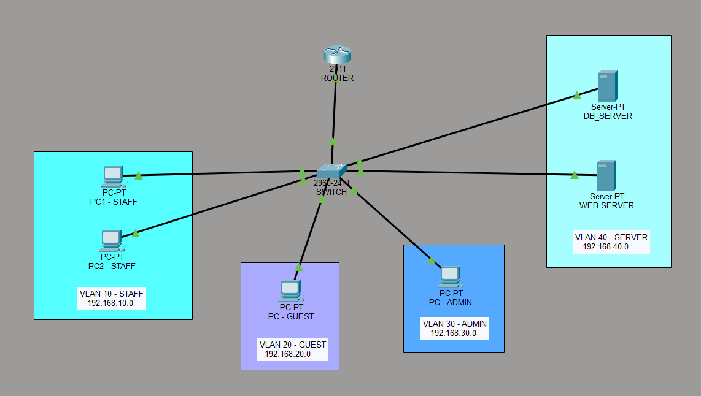

# 🔒 VLAN Segmentation and ACL Security

Designed and implemented a secure segmented LAN using Cisco Packet Tracer,
isolating Staff, Guest, Admin, and Server zones using VLANs and enforcing
access control through Extended ACLs, SSH v2, and Layer 2 Port Security.

## 🧠 Network Topology

## 🗂️ VLAN Design
| VLAN ID | Department | Network         | Gateway       |
|---------|------------|-----------------|---------------|
| 10      | Staff      | 192.168.10.0/24 | 192.168.10.1  |
| 20      | Guest      | 192.168.20.0/24 | 192.168.20.1  |
| 30      | Admin      | 192.168.30.0/24 | 192.168.30.1  |
| 40      | Servers    | 192.168.40.0/24 | 192.168.40.1  |

## 🛠️ Technologies Used
- Cisco Packet Tracer v8.2
- Cisco 2911 Router + Cisco 2960 Switch
- Router-on-a-Stick (Inter-VLAN Routing)
- Extended ACLs
- SSH v2 with RSA Encryption
- Sticky MAC Port Security

## 🔐 Security Features
- **Layer 2:** Sticky MAC Port Security — auto shuts port on rogue device
- **Layer 3:** Extended ACLs — blocks Guest from Database Server
- **Management:** SSH v2 restricted to Admin IP (192.168.30.2) only

## 📊 Test Results Summary
- ✅ Inter-VLAN routing verified via ICMP ping tests
- ✅ ACL correctly blocks unauthorized HTTP and ICMP traffic
- ✅ SSH access restricted to Admin PC only
- ✅ Port Security triggers err-disabled state on rogue device connection
- ✅ Web and Database servers accessible to authorized users only

## 📁 Repository Structure
VLAN-Segmentation-ACL-Security/
├── VLAN_Segmentation_ACL_Security.pdf   # Full project report
├── VLAN_Segmentation_ACL_Security.pkt   # Cisco Packet Tracer file
├── configs/
│   ├── router_config.txt                # Router CLI configuration
│   └── switch_config.txt                # Switch CLI configuration
└── screenshots/
    ├── topology.png
    ├── ping_test.png
    ├── acl_test.png
    ├── ssh_test.png
    ├── http_test.png
    └── port_security.png

## 👥 Team
| Name | Role |
|------|------|
| Shreelakshmi Prabhu | Network Design, VLAN & Routing Configuration, Repository Management |
| Prithvik K S | Security Implementation (ACL, SSH, Port Security, Server Setup) |
